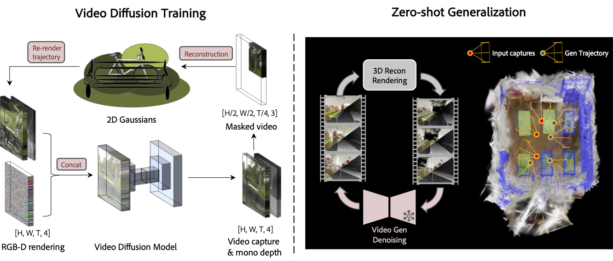

# GenFusion: Closing the Loop between Reconstruction and Generation via Videos

[Project page](https://genfusion.sibowu.com) | [Paper](https://arxiv.org/abs/2503.21219) | [Data (Incoming)](hhttps://genfusion.sibowu.com) <br>



This repo contains the official implementation for the paper "**GenFusion: Closing the loop between Reconstruction and Generation via Videos**". 


## Installation

```bash
conda env create --file environment.yml
conda activate genfusion
cd Reconstruction
CC=gcc-9 CXX=g++-9 pip install submodules/simple-knn
CC=gcc-9 CXX=g++-9 pip install submodules/diff-surfel-rasterization
```
## Generation Model Training

The generation model is finetuned from [DynamiCrafter](https://github.com/Doubiiu/DynamiCrafter).

Step 1. Download the DL3DV Renderings dataset

Step 2. Download pretrained models via Hugging Face, and put the model.ckpt with the required resolution in checkpoints/dynamicrafter_512_v1/model.ckpt.

Step 3. Run the following command to start training on a resolution of 512x320.

```bash
cd ./GenerationModel
sh configs/training_video_v1.0/run_interp.sh
```
Step 4. Finetuned the model on a higher resolution of 960x512.
```bash
sh configs/training_960_v1.0/run_interp.sh
```
If you want to use the model for generation inference, you can download our pre-trained model from [here](https://huggingface.co/Sibo2rr/GenFusion-GenerationModel).

## Reconstruction

If your skip the generation model training, you can download our pre-trained model from [here](https://huggingface.co/Sibo2rr/GenFusion-GenerationModel) and put it in the `./diffusion_ckpt` folder

### Masked 3D Reconstruction

Step 1. The testing scenes in our paper is selected from DL3DV Benchmarkand DL3DV dataset. Download scenes from [Huggingface](https://huggingface.co/datasets/DL3DV/) and put the scenes from `DL3DV_test_list.txt` in the `./data` folder.

Step 2. To get the quantitative results in our paper, you can run the following command.

```bash
cd ./Reconstruction
python genfusion_scripts/batch_ours.py [gpu_ids]
```

To run a masked 3D reconstruction on your own scene, you can use the following command.

```bash
cd ./Reconstruction
python train.py --data_dir [data_dir] \
-m [output_dir] \
--iterations 7_000 \
--test_iterations 7_000 \
--diffusion_ckpt ./diffusion_ckpt/epoch=59-step=34000.ckpt \
--diffusion_config ./generation_infer.yaml \
--num_frames 16 \
--outpaint_type crop \
--start_diffusion_iter 3000 \
--sparse_view 0 \
--downsample_factor 2 \
--diffusion_resize_width 960 \
--diffusion_resize_height 512 \
--diffusion_crop_width 960 \
--diffusion_crop_height 512 \
--patch_size [crop_width] [crop_height] \ # we recommend to use half of the image resolution
--opacity_reset_interval 9000 \
--lambda_dist 0.0 \
--lambda_reg 0.5 \
--lambda_dssim 0.8 \
--densify_from_iter 1000 \
--unconditional_guidance_scale 3.2 \
--repair
```

### Sparse view Reconstruction

Step 1. Download the Mip-NeRF data and train/test split from [ReconFusion](https://drive.google.com/drive/folders/10oT2_OQ9Sjh5wlfJQoGx2y7ZKYwpgNg5)

Step 2. Run the following command to start training.

```bash
cd ./Reconstruction
python genfusion_scripts/batch_sparse.py [gpu_ids]
```

To run a sparse view reconstruction on your own scene, a `train_test_split_{sparse_view}.json` file is required in the following format:

```json
{
  "test_ids": [
    0, 8, 12, ...
  ],
  "train_ids": [
    1, 2, 3, ...
  ]
}
```

Then run the following command:

```bash
python train.py \
--data_dir [data_dir] 
-m [output_dir] \
--iterations 7000 \
--test_iterations 7_000 \
--diffusion_ckpt ./diffusion_ckpt/epoch=59-step=34000.ckpt \
--diffusion_config ./generation_infer.yaml \
--num_frames 16 \
--outpaint_type sparse \
--start_diffusion_iter 1000 \
--sparse_view [num_of_sparse_views] \
--diffusion_resize_width 960 \
--diffusion_resize_height 512 \
--diffusion_crop_width 960 \
--diffusion_crop_height 512 \
--mono_depth \
--repair \
--densify_from_iter 100 \
--diffusion_until 7000 \
--diffusion_every 1000 \
--densify_until_iter 5000 \
--densification_interval 500 \
--opacity_reset_interval 3100 \
--lambda_dist 10.0 \
--lambda_dssim 0.5 \
--lambda_reg 1.0 \
--unconditional_guidance_scale 3.2
```

### Scene Completion
We provide two options to reconstruct the unseen area of the scene.

- Option 1: Pre-defined camera path using [RemoteViewer](https://github.com/hwanhuh/2D-GS-Viser-Viewer), save the trajectory as a json file. Use counter scene in Mip-NeRF360 as an example:
```bash

python train.py \
    --data_dir [data_dir] \
    -m output_ours/counter_completion \
    --test_iterations 7_000 \
    --diffusion_ckpt ./diffusion_ckpt/epoch=59-step=34000.ckpt \
    --diffusion_config ./generation_infer.yaml \
    --num_frames 16 \
    --outpaint_type rotation \
    --add_indices 7 15 \
    --depth_loss \
    --iterations 26000 \
    --diffusion_resize_width 960 \
    --diffusion_resize_height 512 \
    --diffusion_crop_width 960 \
    --diffusion_crop_height 512 \
    --repair \
    --port 6678 \
    --densify_from_iter 500 \
    --densify_until_iter 12000 \
    --diffusion_until 30000 \
    --start_diffusion_iter 5000 \
    --diffusion_every 4000 \
    --opacity_reset_interval 15000 \
    --unconditional_guidance_scale 2.2 \
    --start_dist_iter 3000 \
    --camera_path_file [trajectory file]
```

- Option 2: Use path paramters in the script to determine the shape of sampling path.

```bash
python train.py \
    --data_dir [data_dir] \
    -m [output_dir] \
    --test_iterations 7_000 \
    --diffusion_ckpt ./diffusion_ckpt/epoch=59-step=34000.ckpt \
    --diffusion_config ./generation_infer.yaml \
    --num_frames 16 \
    --outpaint_type rotation \
    --add_indices 7 15 \
    --depth_loss \
    --iterations 26000 \
    --diffusion_resize_width 960 \
    --diffusion_resize_height 512 \
    --diffusion_crop_width 960 \
    --diffusion_crop_height 512 \
    --port 6691 \
    --densify_from_iter 500 \
    --densify_until_iter 12000 \
    --diffusion_until 30000 \
    --start_diffusion_iter 5000 \
    --diffusion_every 4000 \
    --opacity_reset_interval 15000 \
    --repair \
    # define the following parameters for your own scene
    --path_scale 1.0 \ 
    --rotation_angle 90 \
    --position_z_offset 0.5 \
    --distance -0.2 \
    --unconditional_guidance_scale 2.2 \
    --start_dist_iter 3000
```

## Acknowledgements

This project is built upon [2DGS](https://github.com/hbb1/2d-gaussian-splatting) and [DynamiCrafter](https://github.com/Doubiiu/DynamiCrafter). The dataset processing is based on [gsplat](https://github.com/nerfstudio-project/gsplat/tree/main/gsplat). We thank all the authors for their great repos. 


Special thanks to [LiangrunDa](https://github.com/LiangrunDa) for his help on the project website and part of the code. 